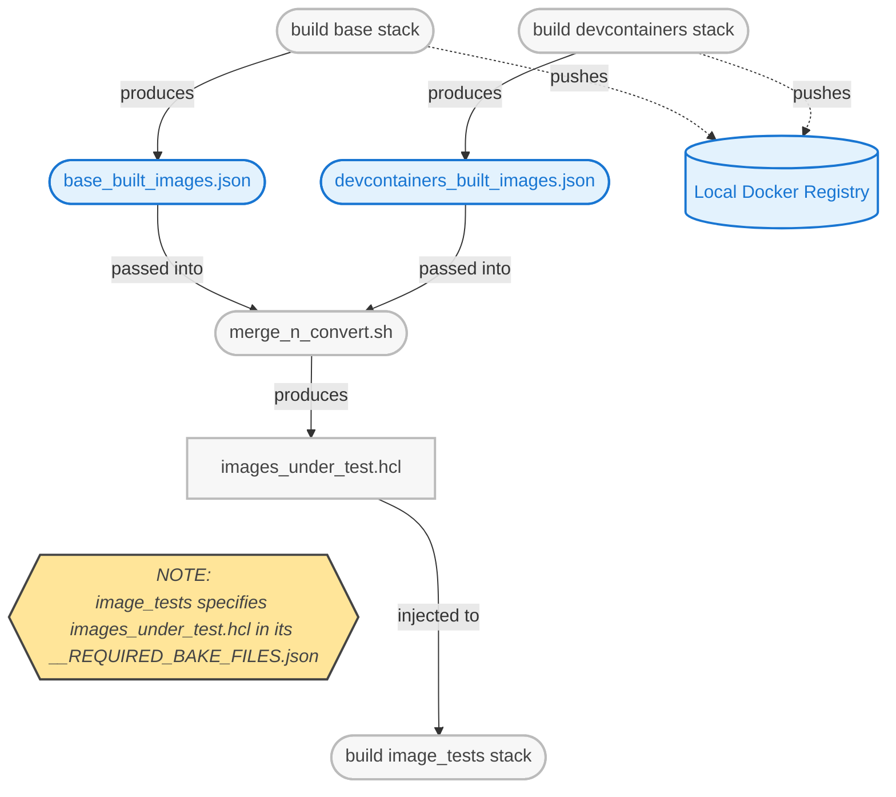
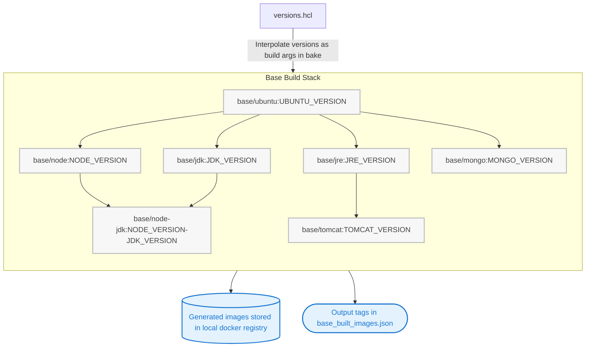
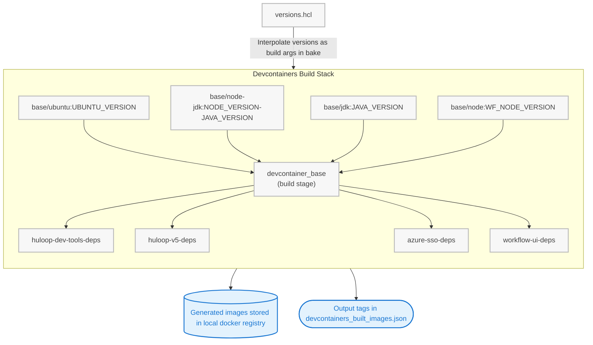

# Table of Contents

- [docker directory](#docker-directory)
- [Quick Start](#quick-start)
- [shake_n_bake.sh (shake-n-bake)](#shake_n_bake.sh-shake-n-bake)
- [Build Stacks](#build-stacks)
  - [Output: Built Images Metadata](#output-built-images-metadata)
- [High-level Build Stack Flow](#high-level-build-stack-flow)
- [Build Stack: Base Images](#build-stack-base-images)
  - [Diagram](#diagram)
  - [Tags Produced](#tags-produced)
  - [Inheritance Notes](#inheritance-notes)
- [Build Stack: Devcontainers Images](#build-stack-devcontainers-images)
  - [Diagram](#diagram)
  - [Base Image per Devcontainer](#base-image-per-devcontainer)
  - [Inheritance Notes](#inheritance-notes)
- [Build Stack: Image Tests](#build-stack-image-tests)
  - [Images and BATS Test Files](#images-and-bats-test-files)
  - [Notes](#notes)
- [Build Stack: Sidecars](#build-stack-sidecars)
  - [Diagram](#diagram)
  - [Tags Produced](#tags-produced)
  - [Inheritance Notes](#inheritance-notes)
- [Build Stack: Runners](#build-stack-runners)

---

## `docker` directory

> **Summary:**
> This directory provides the core Docker build, test, and development container resources for HuLoop projects. It ensures consistent, automated image creation and validation for both local and CI environments.

This directory contains:

- **Base images** for various languages and frameworks
- **Development containers** for local development
- **Automation scripts** and configuration for building, testing, and managing Docker images

**Technologies used:** Docker & Docker Buildx, HCL-based bake files, Bash scripts

> **Note:** Maintained by the HuLoop DevOps/CloudOps team.

---

## Quick Start

> **🚀 Quick Start:** Follow these steps to build and test all images locally. All commands can be run from anywhere inside a devcontainer, as `shake-n-bake` is available in the `PATH`.

1. **Clone the repository:**
   ```sh
   git clone <repo-url>
   cd <repo-directory>/docker
   ```
2. **Build base images:**
   ```sh
   ./shake_n_bake.sh ./base all
   ```
3. **Build devcontainer images:**
   ```sh
   ./shake_n_bake.sh ./devcontainers all
   ```
4. **Merge built image lists for testing:**
   ```sh
   ./merge_n_convert.sh \
     base/base_built_images.json \
     devcontainers/devcontainers_built_images.json \
     > ./image_tests/images_under_test.hcl
   ```
5. **Run image tests:**
   ```sh
   ./shake_n_bake.sh ./image_tests all
   ```

---

## `shake_n_bake.sh (shake-n-bake)`

> **Summary:**
> `shake_n_bake.sh` is a wrapper for Docker Buildx Bake, automating multi-target builds and handling required configuration for local and CI workflows.

`shake_n_bake.sh` is a wrapper script for Docker Buildx Bake. It automates multi-file, multi-target Docker builds using HCL-based bake files and supports additional options for local or CI workflows.

**Key features:**

- Reads a `__REQUIRED_BAKE_FILES.json` file to determine which bake files to use.
- Handles authentication for private GitHub repositories if needed.
- Supports passing extra options to `docker buildx bake` (e.g., `--progress plain`, `--no-cache`).
- Outputs metadata about built images for further automation.

**Basic usage:**

```sh
./shake_n_bake.sh <BUILD_STACK_DIR> <TARGET> [BAKE OPTIONS]
```

- `<BUILD_STACK_DIR>`: Directory containing the required bake files and configuration.
- `<TARGET>`: The bake target to build (as defined in the HCL files).
- `[BAKE OPTIONS]`: Any additional options to pass to `docker buildx bake`.

> **Example:**
> ```sh
> ./shake_n_bake.sh ./devcontainers huloop_dev_tools --progress plain
> ```

For more details and advanced usage, run:

```sh
./shake_n_bake.sh --help
```

> **Note:** All devcontainers have `shake_n_bake.sh` installed as `/usr/bin/shake-n-bake`. You can run it from anywhere inside the container using:
> ```sh
> shake-n-bake <BUILD_STACK_DIR> <TARGET> [BAKE OPTIONS]
> ```

---

## Build Stacks

> **Summary:**
> The build system is organized into modular stacks: base images, devcontainers, and image tests. Each stack produces outputs that can be used as inputs for the next, enabling inheritance and automation.

Each build stack is a self-contained unit that defines how a set of images is built.  
Outputs from one stack can be used as inputs for another, enabling inheritance and modularity.

**Conceptual model:**

- **Base Images (`base/`)**  
  The foundation. Produces essential images (Ubuntu, Node, JDK, Tomcat, MongoDB) with core dependencies and configuration.  
  _Think of these images as the "foundation" for all other images._

- **Development Containers (`devcontainers/`)**  
  The workspace. Builds on top of base images to create ready-to-use environments for developers, adding tools, users, and project-specific setup.  
  _This is the "toolkit" layer, providing a curated set of tools for development._

- **Image Test Suite (`image_tests/`)**  
  The quality gate. Consumes outputs from previous layers, running automated tests (with Bats) to validate that images meet requirements and function as intended.  
  _This is the "inspection" layer, ensuring quality and compliance._

- **Sidecars (`sidecars/`)**  
  The helpers. Provides supporting containers (sidecars) for auxiliary tasks such as keystore generation, secrets management, etc.  
  _This is the "support" layer, running alongside main services to provide runtime or build-time utilities._

- **Runners (`runners/`)**  
  The main services. Builds the primary application containers (workflow, reporting, SSO, etc.) for deployment.  
  _This is the "application" layer, containing the core business logic and APIs._

**How it works:**

- Each stack is defined by its own set of Dockerfiles, HCL bake files, and a `__REQUIRED_BAKE_FILES.json` manifest.
- The output of a stack (a set of images and metadata) can be referenced by another stack, enabling chained builds and tests.
- For example, the images produced by `base/` and `devcontainers/` are merged and fed into `image_tests/` for validation.

### Output: Built Images Metadata

> **Summary:**
> Each stack outputs a list of built images in both JSON and HCL formats. These files are used to chain builds and tests across stacks.

After a successful build, each stack generates two files in its directory:

- `<name>_built_images.json`:  
  A JSON file listing all images built in the current operation, grouped by image name and tag.  
  This file is used as input for further automation, such as merging image lists for testing.

  <details><summary>Example JSON</summary>

  ```json
  {
    "base/ubuntu": ["24.04"],
    "base/node": ["20.17.0", "18.20.5"],
    "base/jdk": ["17.0.14"]
  }
  ```
  </details>

- `<name>_built_images.hcl`:  
  An HCL file containing the same image information, formatted as a Terraform/HCL variable.  
  This is useful for passing image lists into other HCL-based bake files or workflows.

  <details><summary>Example HCL</summary>

  ```hcl
  variable "_images" {
    default = {
      "base/ubuntu" = [
        "24.04"
      ]
      "base/node" = [
        "20.17.0",
        "18.20.5"
      ]
      "base/jdk" = [
        "17.0.14"
      ]
    }
  }
  ```
  </details>

> **Tip:** The `.json` outputs from the `base/` and `devcontainers/` stacks are merged to produce the `images_under_test.hcl` file used by the `image_tests/` stack.

  <details><summary>Example (`images_under_test.hcl`)</summary>

  ```hcl
  variable "_images" {
    default = {
      "base/ubuntu" = [
        "24.04"
      ]
      "devcontainers/huloop-dev-tools" = [
        "temp"
      ]
    }
  }
  ```
  </details>

---

# High-level Build Stack Flow

This section provides a high-level overview of how the build and test stacks interact, including the flow of image artifacts and configuration files between them.



---

# Build Stack: Base Images

## Diagram

This diagram shows how each image in the base build stack is built and tagged, including inheritance relationships and all tags produced (from `base_built_images.json`).



### Tags Produced

- `base/ubuntu:<UBUNTU_VERSION>`
- `base/jdk:<JDK_VERSION>`
- `base/jre:<JRE_VERSION>`
- `base/mongo:<MONGO_VERSION>`
- `base/node:<NODE_VERSION>` (Note that currently we build a v20 and v18 image)
- `base/node-jdk:<NODEJDK_VERSION>`
- `base/tomcat:<TOMCAT_VERSION>`

### Inheritance Notes

- All images ultimately derive from `base/ubuntu`.
- `base/node-jdk` inherits from both `base/node` and `base/jdk` (multi-stage/copy).
- `base/tomcat` inherits from `base/jre`.

---

# Build Stack: Devcontainers Images

## Diagram

This diagram shows which base image each devcontainer inherits from, how versions are interpolated from `versions.hcl`, and which ones add extra tools. All devcontainers receive a common set of tools and configuration during the `devcontainer_base` build stage (see Dockerfile).



### Base Image per Devcontainer

- `huloop-dev-tools:temp`: `base/ubuntu:UBUNTU_VERSION`
- `huloop-v5:temp`: `base/node-jdk:NODE_VERSION-JAVA_VERSION`
- `azure-sso:temp`: `base/jdk:JAVA_VERSION`
- `workflow-ui:temp`: `base/node:WF_NODE_VERSION`

### Inheritance Notes

- Each devcontainer image is built from `devcontainer_base`, which installs a common set of tools and configuration (az, gh, sudo, git, jq, etc).
- Only `huloop-dev-tools:temp` adds extra tools and configuration; the others are minimal wrappers.
- All version values are interpolated from `versions.hcl` during the bake process, just like the base stack.
- All images are tagged with `:temp` during the build process. They will be renamed with their final tags when pushed to the registry.

---

# Build Stack: Image Tests

This section describes the build process for the image tests stack, which validates the following images and tags (from `images_under_test.hcl`).

## Images and BATS Test Files

| Image:Tag                                 | BATS Test Files                      |
|-------------------------------------------|--------------------------------------|
| base/ubuntu:24.04                         | ubuntu.bats                          |
| devcontainers/huloop-dev-tools:temp        | ubuntu.bats, huloop_dev_tools.bats   |
| base/jdk:17.0.14                          | ubuntu.bats, jdk.bats                |
| base/jre:17.0.14                          | ubuntu.bats, jre.bats                |
| base/node:20.17.0                         | ubuntu.bats, node.bats               |
| base/node:18.20.5                         | ubuntu.bats, node.bats               |
| base/tomcat:9.0.105                       | ubuntu.bats, jre.bats, tomcat.bats   |
| base/mongo:8.0.5                          | ubuntu.bats, mongo.bats              |
| base/node-jdk:20.17.0-17.0.14             | *(no explicit mapping)*              |
| devcontainers/azure-sso:temp              | *(no explicit mapping)*              |
| devcontainers/huloop-v5:temp              | *(no explicit mapping)*              |
| devcontainers/workflow-ui:temp            | *(no explicit mapping)*              |

### Notes
- Images with multiple tags (e.g., base/node) get the same set of tests for each tag.
- Images without an explicit mapping in `docker-bake.hcl` do not have BATS tests run unless added to the config.
- The test stack runs the appropriate validation and test suites for each image:tag pair listed above.
- Test results and reports are generated for all images and tags in the list.

---

## Build Stack: Sidecars

> **Summary:**  
> The sidecars stack provides supporting containers that are used alongside main application containers, typically to perform auxiliary tasks such as keystore generation or secret management.

### Structure

- **Location:** `docker/sidecars/`
- **Bake File:** `docker-bake.hcl`
- **Manifest:** `__REQUIRED_BAKE_FILES.json`
- **Example Sidecar:** `keystore-builder` (see `entra_sso_keystore_builder/`)

### How it works

- The stack is defined by `docker-bake.hcl`, which specifies targets for each sidecar image.
- Each sidecar target can inherit common build arguments and user configuration.
- The `keystore-builder` sidecar builds a container that generates a Java keystore from provided secrets and certificates at runtime.
- The entrypoint script (`entrypoint.sh`) uses `keytool` to import certificates and generate key pairs, supporting parameterization via environment variables or arguments.

### Example: Build all sidecars

```sh
./shake_n_bake.sh ./sidecars all
```

### Example: Entrypoint for keystore-builder

```sh
/opt/entrypoint.sh [SECRETS_DIR] [KEYSTORE_PATH] [ALIAS] [DNAME_CN] [DNAME_OU] [DNAME_O] [DNAME_L] [DNAME_ST] [DNAME_C]
```

- Defaults are provided for all arguments.
- Expects `signature.cer` and `key.pass` in the secrets directory.

### Tags Produced

- `sidecars/keystore-builder:<tag>` (tagged with timestamp and/or version)

### Inheritance Notes

- Sidecar images can inherit common build arguments and user configuration via the `_common` and `_user` targets in the bake file.
- The `keystore-builder` sidecar is built from a JDK 17 base image and runs as a non-root user.
- The entrypoint script is copied in with correct ownership and permissions for security.

---

## Build Stack: Runners

> **Summary:**  
> The runners stack builds the main application service containers for HuLoop, such as workflow, reporting, and SSO services. These are the primary containers deployed in production.

### Structure

- **Location:** `docker/runners/`
- **Bake File:** `docker-bake.hcl`
- **Manifest:** `__REQUIRED_BAKE_FILES.json`
- **Targets:**  
  - `workflow` (Spring Boot, layered JAR)
  - `okta` (Spring Boot, SSO)
  - `reporting` (Spring Boot, layered JAR)
  - `entra-sso-portal` (Spring Boot, SAML portal)
  - `entra-sso-agent` (Spring Boot, SAML agent)

### How it works

- Each target is defined in `docker-bake.hcl` and inherits common build arguments (base images, download URLs, etc.).
- The build process uses the `shake_n_bake.sh` script, which reads the manifest and invokes Docker Buildx Bake with the correct configuration.
- Artifacts (JARs) are downloaded from Azure Blob Storage or other sources, as specified by the `DOWNLOAD_URL` and `PREFIX` arguments.
- Each runner image is tagged with both a timestamp and a prefix for traceability.

### Example: Build all runners

```sh
./shake_n_bake.sh ./runners all
```

### Output

- Built images are listed in `runners_built_images.json` and are ready for push to the registry or deployment.
